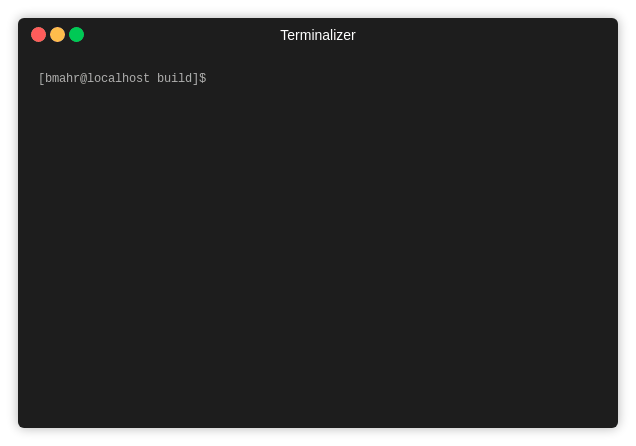

# Brent's Black-Box Method

A collection of root approximation methods, as discussed on [thoughts-on-cpp.com](https://thoughts-on-cpp.com/2019/06/06/numerical-methods-with-cpp-part-3-root-approximation-algorithms).

Methods:
 - [Bisection](https://en.wikipedia.org/wiki/Bisection_method)
 - [Newton Method](https://en.wikipedia.org/wiki/Newton%27s_method)
 - [Secant Method](https://en.wikipedia.org/wiki/Secant_method)
 - [Dekker Method](https://en.wikipedia.org/wiki/Brent's_method#Dekker's_method)
 - [Brent Method](https://en.wikipedia.org/wiki/Brent%27s_method)

## Getting Started

To get it up and running you just need to execute:
- `~\numericalIntegration\build\cmake .. -DCMAKE_TOOLCHAIN_FILE={YOUR_PATH_TO_VCPKG}/scripts/buildsystems/vcpkg.cmake`
- `~\numericalIntegration\build\cmake --build .`

You can execute the program by `./rootApproximation`

### Prerequisites

- [fmt](http://fmtlib.net/latest/index.html) external library used for formatting and printing results

## Authors

* **Benjamin Mahr** - [Ben1980](https://github.com/Ben1980)

## License

This project is licensed under the MIT License - see the [LICENSE](LICENSE) file for details
